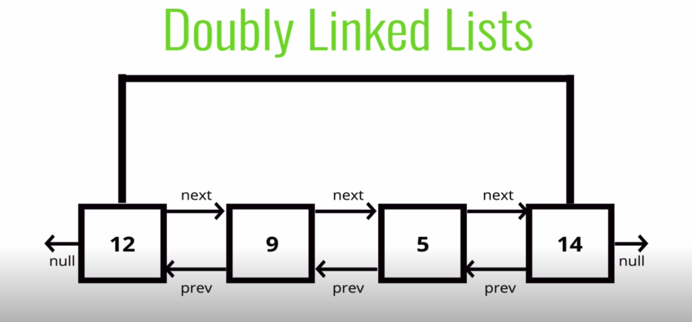

#Doubly LinkedList

#Pushing pseudoCode

* Create a new node with the value passed to the function
* If the head property is null set the head and tail to be the newly created node
* If not, set the next property on the tail to be that node
* Set the previous property on the newly create node to be the tail
* Set the tail to be the newly created node
* Increment the length
* Return the list

# Popping pseudoCode

* If there is no head, return undefined
* Store the current tail in a variable to return later
* If the length is 1, set the head and tail to be null
* Update the tail to be the previous Node
* Set the newTail's next to null
* Decrement the length
* Return the value removed

# Shifting 
### Removing a node from the beginning of doubly Linked List

* If the length is 0, return undefined
* Store the current head property in a variable (we'll call it old head)
* If the length is one
   * set the head to be null
   * set the tail to be null
* Update the head to be the next of the old head
* Set the head's prev property to null
* Set the old head's next to null
* Decrement the length
* Return old head

# Unshifting pseudoCode

* Create a new node with the value passed to the function 
* If the length is 0
  * Set the head to be the new node
  * Set the tail to be the new node
* Otherwise
  * Set prev property on the head of the list to be the new node
  * Set the next propety on the new node to be the head property
  * Update the head to be the new node
* Increment the length
* Return the list

# Get pseudocode

* If the index is less than 0 or equal to the length, return null
* If the index is less than or equal to hald the length of the list
  * Loop through the list starting from the head and loop towards the middle
  * Return the node once it is found
* If the index is greater than half length of the list 
  * Loop through the list starting from the head and loop towards the middle
  * Return the node once it is found
* If the index is greater than half the length of the list 
   * Loop through the list starting from the tail and loop towards the middle 
   * Return the node once it is found

# Set pseudoCode

* create a variable which is the result of the get method at the index passed to the function
  * If the get method returns a valid node, set the value of that node to be the value padded to the function
  * Return the true
* Otherwise, fase

# Inset PseudoCode

* If the index is less than zero or greater than or equal to the length return false
* If the index is 0, unshift
* If the index is the same as the length, push
* Use the get method to access the index-1
* Set the next and prev properties on the correct nodes to link everything together
* increment the length
* return ture

# Removing pseudoCode

* If the index is less than zero or greater than or equal to the length return undefined
* If the index is 0, shift
* If the index is the same as the length-1, pop
* Use th get method to retrieve the item to be removed
* Update the next and prev properties to remove the found node from the list
* Set next and prev to null on the found node
* Decrement the length
* Return the removed node
