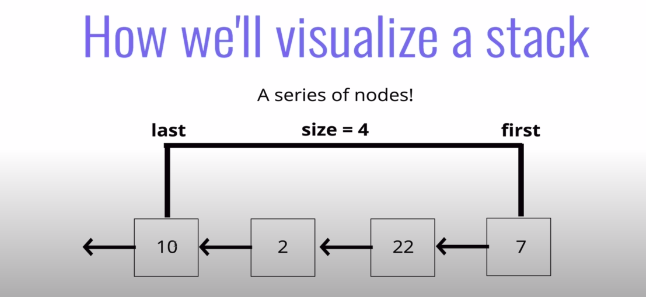

# What is a STACk

### A LIFO data Structure!

### There is more than one way of implementing a Stack.
    The easyest of implementing stack is array implementation. 
    example: stack = []; 
     use buultin method stack.push() && stack.pop() 

## The other way is implementing Stack in linked list 

# pushing pesudoCode

* The function should accept a value
* Create a new node with that value
* If there are no nodes in the stack, set the first and last property to be the newly created node
* if There is at least one node, create a variable that stores the current first property on the stack
* Reset the first property to be the newly created node 
* Set the next propety on the node to be the previously created variable
* Increment the size of the stack by 1

# POP pseudocode

* If there are no nodes in the stack, return null
* Create a temporary varibale to store the first property on the stack
* If there is only 1 node, set the first and last property to be null
* If there is more than one node, set the first propety to be the next property on the current first 
* Decrement the size by 1
* Return the value of the node removed