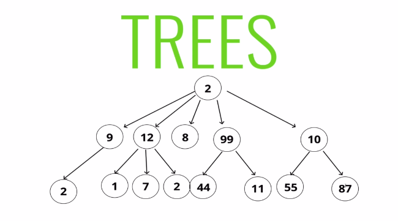

# What is tree

A data Structure that consists of nodes in a parent/child relationship

# Tree Terminology

* **Root** - The top node in a tree
* **Child** - A node directly connected to another node when moving away form the root 
* **parent** - The converse notion of a child
* **Siblings** - A group of nodes with the same parent.
* **Leaf** - A node with no children
* **Edge** - The connection between one node and another

# Kinds of Trees 

* Trees
* Binary Trees
* Binary Search Trees

# How BSTS WORK

* Every parent node has at most two children 
* Every node to the left of a parent node is always less than the parent
* Every node to the right of a parent node is always greater than the parent

# INSERTING A NODE

   ## **Steps** Iteratively or Recursively

* Create a new node
* Starting at the root
   * check if there is root, if no the root now becomes that new node!
   * If there is a root, check if the value of the new node is greater than or less than the value of the root 
   * If it is greater 
        * Check to sed if there is a node to the riht
            * If there is, move to that node and repeat these steps
            * If there is not, add that node as the right propety
        * If it is less
             * Check to see if there is a node to the left
                * If there is move to that node and repeat these steps
                * If there is not, add that node as the left property

# Finding a node in a BST
 
  ### **Steps** - Iteratively or Recursively

* Starting at the root
  * Check if there is a root, if not we're done searching!
  * If there is root, check if the value of the new node is the value we are looking for 
      * if we found it we are done
  * If not check to see if the value is greate than or less than the value of the root
  * If it is greater 
      * Check to see if there is a node to the right
         * If there ism move to that node and repeat these steps
         * If there is not, we're done searching!
  * If it is less
      * Check to see if there is a node to the left
         * If there is, move to that node and repeat these steps
         * If there is not, we're done searching