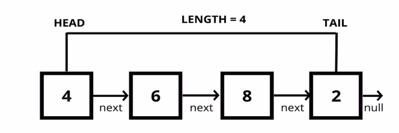

# Linked List 

* A data structure that contains a head, tail and length property

* linked Lists consist of nodes and each node has a value and a pinter to another node or null

# Pushing pseudocode

*  this function should accept a value
* Create a new node using the value passed to the function 
* If there is no head property on the list, set the head and tail to be the newly created node
* Otherwise set the next property on the tail to be the new node and set the tail property on the list to be the newly created node
* Increment the value by one
* Return the linked List

# popup psedocode

* if there are no node in the list, return undefined
* Loop through the list until you reach the tail
* Set the next property of the 2nd to last node to be null
* Set the tail to be 2nd to last node
* Decrement the lenght of the list by 1
* Return the value of the node removed

# Shifting pseudoCode

* If there are no nodes, return undefined
* Store the current head property in a variable 
* Set the head property to be the current heads next property
* Decrement the length by 1
* Return the value of the node removed 

# Unshifting pseudoCode

* This function should accept a value
* Create a new node using the value passed to the function
* if there is no head property on the list, set he head and tial to be the newly created node
* Ohterwise set the newly created node's next property to be the currnet head property on the list 
* Set the head property on the list to be that newly creatd node
* Increment the length of the list by 1
* Return the linked list 

# Get pseudoCode

* This function Should accept an index
* If the index is less than zero or greater than or equal to the length of the list, return null
* Loop through the list until you reach the index and return the node at that specific index

# Set pseudoCode 

* This function should accept a value and an index
* Use your get function to find the specific node. 
* If the node is not found, return false
* If the node is found, set the value of that node to be the value passed to the function and return true

# Insert pseudocode 

* If the index is less zero or greater than the length, return false
* If the index is the same as the length, push a new node to the end of the list
* If the index is 0, unshift a new node to the start of the list
* Otherwise, using the get method, access the node at the index -1
* Set the next property on that node to be the new node.
* Increment the length
* Return true

# Remove pseudoCode 

* If the index is less than zero or greater than the length, return undefined
* If the index is the same as the length-1, pop
* if the index is 0, shift
* Otherwise, using the get method, asscess the node at the index-1
* Set the next property on that node to be the next of the node
* Decrement the length
* Return the value of the node removed

# Reverse Pseudocode

* Swap the head and tail
* Create a varibale called next
* Create a variabe called prev
* create a variable called node and initialize it to the head property
* Loop through the list 
* set next to be the next property on whatever node is 
* Set the next property on the node to be whatever prev is 
* Set prev to be the value of the node variable
* Set the node variable to be the value of the next variable