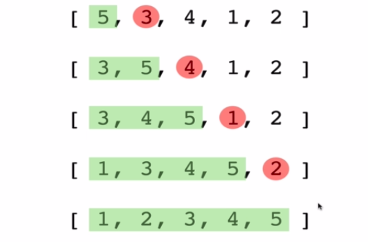

## Insertion Sort 

 
 Builds up the sort by gradually creating a larger left half which is always sorted.

 

 # Insertion sort pesudo Code

 * start by picking second element in the array.
 * Now compare the second element with the one before if and swap if necessary.
 * Contunie to the next element and if it is in the incorrect order iterate throw the sorted portion(i.e. the left side) to place the element in the correct place. 