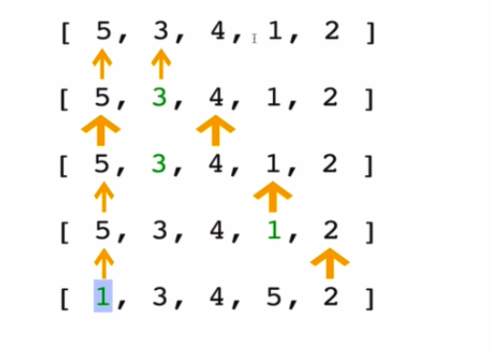

## Selection Sort

  
Similar to bubble sort, but instaed of first sort placing large values into sorted position, it sorted small values into sorted position

  

  ## Selection sort pseudoCode

  * store the first element as the smallest value 
  * Compare this item to the next item in the array until you find a smaller number
  * if smaller number is found, designate that smaller number to be the new 'minimum' and continue until the end of array
  * if the minimum is not value(index) you initially began with, swap the two values
  * Repeat this with the next element until the array is sorted