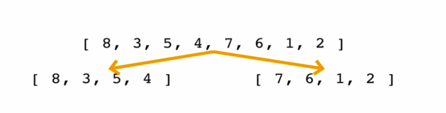
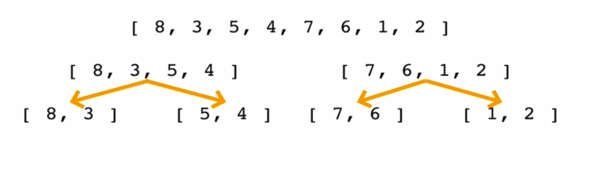
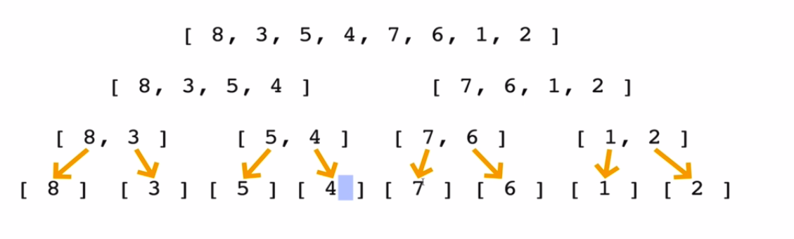
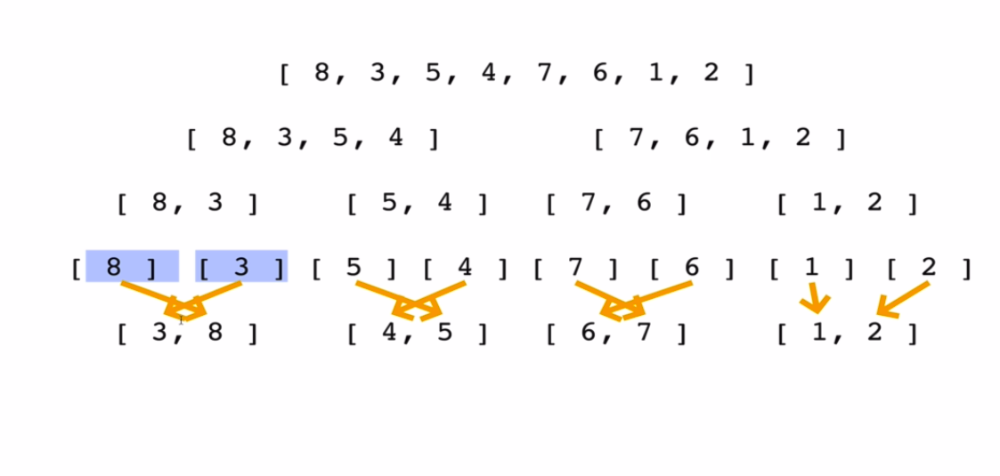
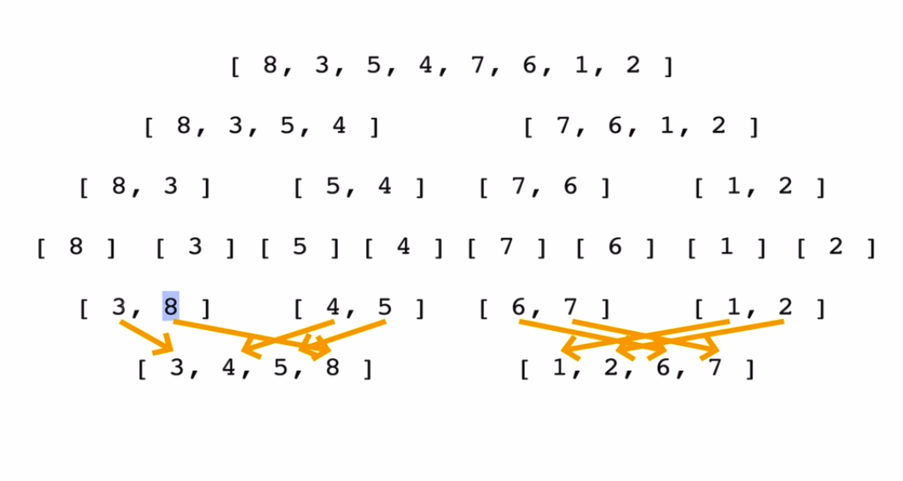
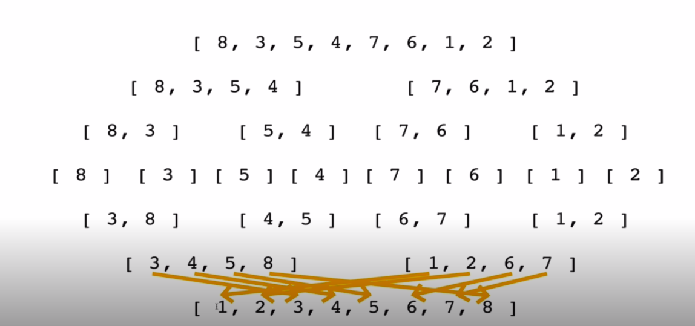
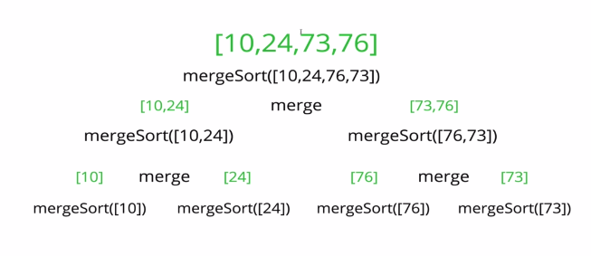
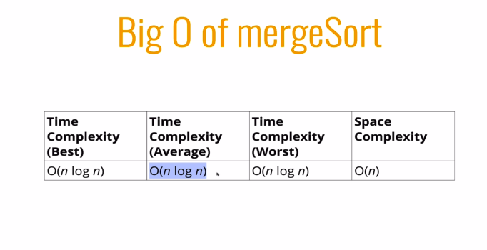

## Merge Sort

* It is a combination of two things - marging and sorting
* Exploits the fact that arrays of 0 or 1 element are always sort
* Works by decomposing an array into smaller arrays of 0 or 1 elements, then building up a newly sorted array. 

## Merging Arrays

* In order to impliment merge sort, it is useful to first impliment a function responsible for merging two sorted arrays
* Give two arrays which are sorted, this helper function should create a new array which is also sorted, and consists of all of the elements in the two  input arrays
* this function should run in O(n + m) time and  O(n + m) space and should not modify the parameters passed to it

---

## Merging Arrays pseudoCode

* create an empty array, take a look at smallest values in each input arrays
* While there are still values we haven't looked at ...
    * If the value in the first array is smaller than the value in the second array, push the value in the second array, push the value in the first array into our results and move on the next value in the first array
    * If the values in the first array is larger than the value in the second array, push the value  in the second array into our results and move on to the next value in the second array. 
    * Once we exhaust one array, push in all remaining values from the other array

---
## MergeSort PseudoCode

* Break up the array into  halves until you have the arrays that are empty or have one element. 
* Once you have smaller sorted arrays, merge those arrays with other sorted arrays until you are back at the full length of the array
* Once the array has been merged been togather, return the merged (and sorted) array

---

## time and space complexity

