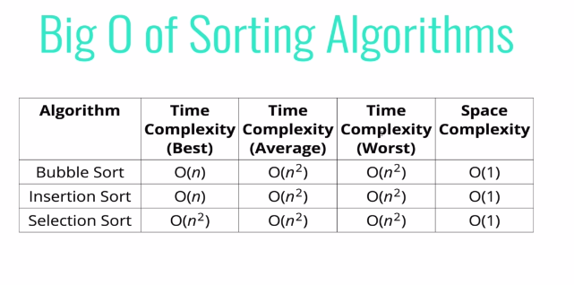

### javaScript has a sort method

but it does not always work the way you expect. 
```js 
  [6, 4, 15, 10].sort(); 
  //[10, 15, 4, 6]
```

  ## you can tell the javaScript how to sort 

<ul>
<li>the built in sort method accepts an optional comparator function</li>
<li>You can use this comparator function to tell javaScript how you want it to sort</li>
<li>The comparators looks at pairs of element (a and b), determines their sort order based on the return value</li>
<ul>
<li>If it returns a negative number, a should come before b</li>
<li>if it returns a positive number, a should come after b </li>
<li>if it returns 0, a and b are the same as far as the sort is connerned</li>
</ul>
</ul>

> EXAMPLE
```js
function numberCompare(num1, num2){
  return num1 - num2;  
}

 [6, 4, 15, 10].sort(numberCompare); 
 //[4, 6, 10, 15]

 ```

 > sort string by based its length rather than alphabatically

 ```js 
 function comparByLen(strOne, strTwo){
   return strOne.length - strTwo.length; 
 } 

 ["steele", "colt" , "dataStructure" "algorithms"].sort(comparByLen); 
 ```
 

 ## Time and space complexity of bubble, insertion and selection sort

  ;